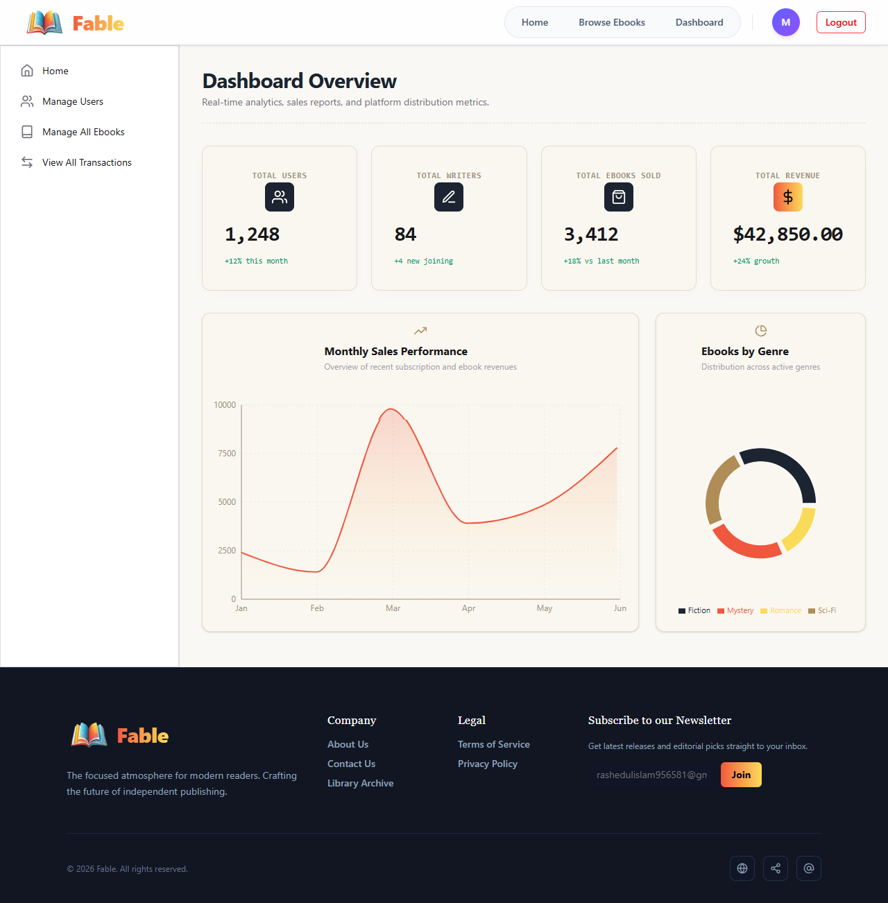
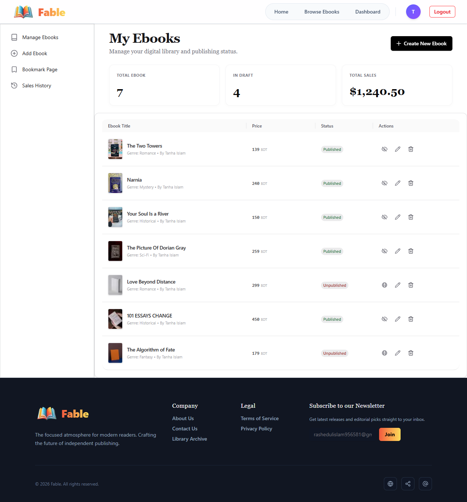
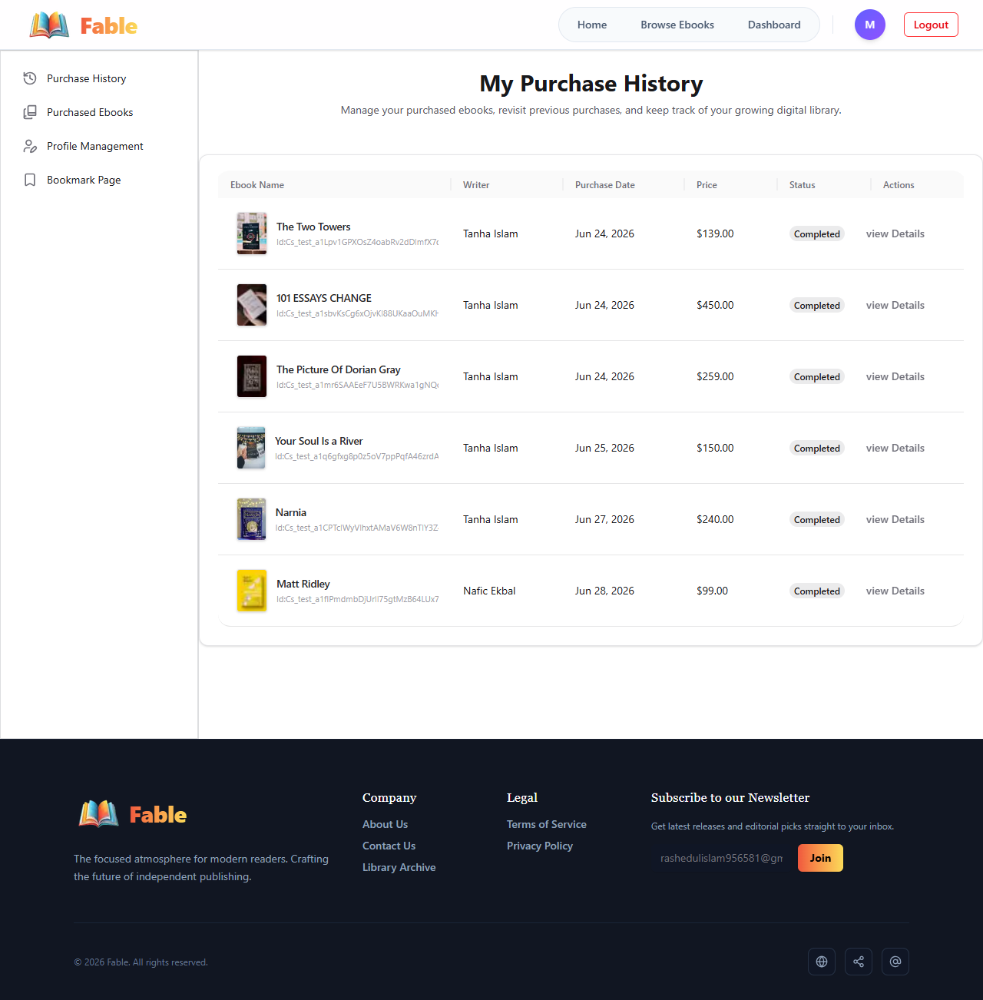

<div align="center">

# 📚 Fable — Ebook Sharing Platform

### *Discover, Read & Share Original Ebooks*

<br/>

[](https://fable-ebook-sharing-platform.vercel.app/)
[](https://github.com/rashedulislam595/Fable-Ebook-Sharing-Platform)
[](https://github.com/rashedulislam595/Fable-Ebook-Sharing-Platform-Server)
[](https://fable-ebook-sharing-platform-server.vercel.app/)

<br/>


</div>

---

## 📖 About The Project

**Fable** is a full-stack digital ebook sharing platform that bridges the gap between talented writers and avid readers. Writers can publish original ebooks after a one-time verification payment, while readers browse, purchase, and enjoy a curated library of content — all within a secure, role-based ecosystem overseen by an admin.

> *"Democratizing access to literature — one ebook at a time."*

---

## 🖼️ Screenshots

### 🏠 Home Page


---

### 📚 Browse Ebooks


---

### 🛡️ Admin Dashboard


---

### ✍️ Writer Dashboard


---

### 👤 Reader Dashboard


---

## 🌐 Live Links

| Resource | Link |
|----------|------|
| 🖥️ Live Website | [fable-ebook-sharing-platform.vercel.app](https://fable-ebook-sharing-platform.vercel.app/) |
| 📦 Client GitHub | [Fable-Ebook-Sharing-Platform](https://github.com/rashedulislam595/Fable-Ebook-Sharing-Platform) |
| 🔧 Server GitHub | [Fable-Ebook-Sharing-Platform-Server](https://github.com/rashedulislam595/Fable-Ebook-Sharing-Platform-Server) |
| 🔗 Server API | [fable-ebook-sharing-platform-server.vercel.app](https://fable-ebook-sharing-platform-server.vercel.app/) |

---

## ✨ Key Features

### 🔐 Authentication & Authorization
- Email/password registration and login with **JWT** (7-day expiry)
- **Google OAuth** login via BetterAuth
- Role selection after registration — **Reader** or **Writer**
- Protected private routes — no redirect on page reload for logged-in users

### 🏠 Home Page
- Hero banner with animated tagline *"Discover & Read Original Ebooks"*
- **Featured Ebooks** — latest 6 ebooks fetched dynamically from DB
- **Top Writers** — 3 most-sold writers with avatars and names
- **Genre Explorer** — Fiction, Mystery, Romance, Sci-Fi, Fantasy, Horror, and more — each linked to a filtered browse page

### 📚 Browse Ebooks (Public)
- Responsive grid: 2 cols (mobile) → 3 cols (tablet) → 4 cols (desktop)
- **Search** by title or writer name
- **Filter** by genre, price range, and availability
- **Sort** by newest, price low→high, price high→low
- Skeleton loaders and friendly empty states

### 📄 Ebook Details Page
- High-res cover image, title, writer, description, price, genre, status, upload date
- **Bookmark** ebooks for later
- **Stripe Checkout** integration — post-payment full content unlocked
- Writers cannot purchase their own ebooks
- Dynamic "Already Purchased" state shown automatically

### 🗂️ Role-Based Dashboards

#### 👤 Reader (`/dashboard/user`)
- Purchase history table (ebook, writer, price, date, status)
- Purchased ebooks gallery with links to details
- Bookmarked ebooks gallery
- Profile view

#### ✍️ Writer (`/dashboard/writer`)
- Manage ebooks — publish/unpublish, edit, delete
- Add/Edit ebook form with imgBB image upload
- Sales history table (ebook, buyer, date, amount)
- Bookmarked ebooks gallery

#### 🛡️ Admin (`/dashboard/admin`)
- **Analytics Overview** — total users, total writers, total ebooks sold, total revenue
- **Charts** — monthly sales chart + ebooks by genre pie chart (Recharts)
- Manage all users — change roles, delete accounts
- Manage all ebooks — publish/unpublish, delete any ebook
- View all transactions — publishing fees & purchases

### 💳 Payment (Stripe)
- Stripe Checkout session created on "Buy Now" click
- Post-payment: purchase record stored in DB, full content unlocked instantly

### 🖼️ Image Hosting
- All ebook cover images and profile pictures stored via **imgBB API**

### ⚡ UX & UI Polish
- Fully responsive across all screen sizes
- Consistent brand color theme throughout
- Global loading spinner + skeleton loaders for cards and tables
- Custom **404 page** with illustration and "Go Home" button
- API error toasts for real-time user feedback
- Error boundary fallback UI for runtime errors

---

## 🛠️ Tech Stack

### 🖥️ Frontend (Client)

| Package | Version | Purpose |
|---------|---------|---------|
| `next` | ^16.2.9 | Full-stack React framework |
| `react` | 19.2.4 | UI library |
| `react-dom` | 19.2.4 | DOM rendering |
| `better-auth` | ^1.6.19 | Google OAuth integration |
| `@better-auth/mongo-adapter` | ^1.6.19 | MongoDB adapter for BetterAuth |
| `@heroui/react` | ^3.2.1 | UI component library |
| `@heroui/styles` | ^3.2.1 | HeroUI styles |
| `@stripe/stripe-js` | ^9.8.0 | Stripe payment UI (client-side) |
| `stripe` | ^22.2.3 | Stripe server-side SDK |
| `recharts` | ^3.9.0 | Charts & data visualizations |
| `react-icons` | ^5.6.0 | Icon library |
| `react-toastify` | ^11.1.0 | Toast notifications |
| `lucide-react` | ^1.3.0 | Icon components |
| `mongodb` | ^7.3.0 | MongoDB driver |
| `tailwindcss` | ^4 | Utility-first CSS framework |

### 🔧 Backend (Server)

| Package | Version | Purpose |
|---------|---------|---------|
| `express` | ^5.2.1 | Web server framework |
| `mongodb` | ^7.3.0 | MongoDB driver |
| `cors` | ^2.8.6 | Cross-origin request handling |
| `dotenv` | ^17.4.2 | Environment variable management |

---

## 🚀 Getting Started

### Prerequisites
- Node.js v18+
- MongoDB Atlas account
- Stripe account (publishable & secret keys)
- imgBB API key
- Google OAuth credentials (for BetterAuth)

---

### 📦 Client Setup

```bash
# 1. Clone the repository
git clone https://github.com/rashedulislam595/Fable-Ebook-Sharing-Platform.git
cd Fable-Ebook-Sharing-Platform

# 2. Install dependencies
npm install
```

Create a `.env.local` file in the root:

```env
NEXT_PUBLIC_API_BASE_URL=your_server_url
NEXT_PUBLIC_STRIPE_PUBLISHABLE_KEY=your_stripe_publishable_key
NEXT_PUBLIC_IMGBB_API_KEY=your_imgbb_api_key
BETTER_AUTH_SECRET=your_better_auth_secret
BETTER_AUTH_URL=http://localhost:3000
GOOGLE_CLIENT_ID=your_google_client_id
GOOGLE_CLIENT_SECRET=your_google_client_secret
MONGODB_URI=your_mongodb_connection_string
```

```bash
# 3. Run the development server
npm run dev
```

Open [http://localhost:3000](http://localhost:3000) in your browser.

---

### 🔧 Server Setup

```bash
# 1. Clone the server repository
git clone https://github.com/rashedulislam595/Fable-Ebook-Sharing-Platform-Server.git
cd Fable-Ebook-Sharing-Platform-Server

# 2. Install dependencies
npm install
```

Create a `.env` file in the root:

```env
MONGODB_URI=your_mongodb_connection_string
JWT_SECRET=your_jwt_secret_key
STRIPE_SECRET_KEY=your_stripe_secret_key
CLIENT_URL=http://localhost:3000
PORT=5000
```

```bash
# 3. Start the server
npm start
```

---

## 🔐 Environment Variable Security

All sensitive credentials are secured via environment variables and excluded from version control using `.gitignore`.

| Variable | Location | Purpose |
|----------|----------|---------|
| `MONGODB_URI` | Server `.env` | MongoDB URI — never exposed publicly |
| `JWT_SECRET` | Server `.env` | Token signing secret — server-side only |
| `STRIPE_SECRET_KEY` | Server `.env` | Stripe secret — never sent to browser |
| `NEXT_PUBLIC_STRIPE_PUBLISHABLE_KEY` | Client `.env.local` | Public key for Stripe.js |
| `NEXT_PUBLIC_IMGBB_API_KEY` | Client `.env.local` | imgBB upload API key |
| `GOOGLE_CLIENT_SECRET` | Client `.env.local` | OAuth secret — server-side only |

---

## 📁 Project Structure

```
client/ (Next.js 16)
├── public/
│   └── images/              # Screenshots & static assets
├── src/
│   └── app/
│       ├── (auth)/          # Login & Register pages
│       ├── browse/          # Browse ebooks page
│       ├── ebook/[id]/      # Ebook details page
│       ├── dashboard/
│       │   ├── user/        # Reader dashboard
│       │   ├── writer/      # Writer dashboard
│       │   └── admin/       # Admin dashboard
│       ├── layout.js        # Root layout
│       └── page.js          # Home page
├── .env.local               # Environment variables (git-ignored)
└── package.json

server/ (Express.js)
├── index.js                 # Entry point & all route handlers
├── vercel.json              # Vercel deployment config
├── .env                     # Environment variables (git-ignored)
└── package.json
```

---

## 👥 User Roles

| Role | Capabilities |
|------|-------------|
| **Guest** | Browse ebooks, view details |
| **Reader** | Purchase ebooks, bookmark, view purchase history |
| **Writer** | All Reader perks + upload/manage own ebooks, view sales history |
| **Admin** | Full control — users, all ebooks, transactions, analytics |

---

## 📊 Pages & Routes

| Page | Route | Access |
|------|-------|--------|
| Home | `/` | Public |
| Browse Ebooks | `/browse` | Public |
| Ebook Details | `/ebook/[id]` | Public |
| Reader Dashboard | `/dashboard/user` | Reader only |
| Writer Dashboard | `/dashboard/writer` | Writer only |
| Admin Dashboard | `/dashboard/admin` | Admin only |
| Login | `/login` | Guest only |
| Register | `/register` | Guest only |
| 404 Not Found | `*` | Public |

---

## ⚙️ Deployment

Both client and server are deployed on **Vercel**.

- ✅ No CORS errors — proper origin whitelisting configured
- ✅ No 404 on page reload — Next.js handles all routes server-side
- ✅ No 504 timeouts — lightweight API with optimized MongoDB Atlas queries
- ✅ Logged-in users stay authenticated on private route reload

---

## 🙏 Acknowledgements

- [Next.js](https://nextjs.org/) — Full-stack React framework
- [Stripe](https://stripe.com/) — Seamless payment integration
- [imgBB](https://imgbb.com/) — Free image hosting API
- [BetterAuth](https://www.better-auth.com/) — Modern auth with Google OAuth
- [MongoDB Atlas](https://www.mongodb.com/atlas) — Cloud database
- [HeroUI](https://www.heroui.com/) — Beautiful UI components
- [Recharts](https://recharts.org/) — Composable charting library
- [Vercel](https://vercel.com/) — Zero-config deployment

---

<div align="center">

Made with ❤️ by [Rashedul Islam](https://github.com/rashedulislam595)

⭐ Star this repo if you found it helpful!

</div>